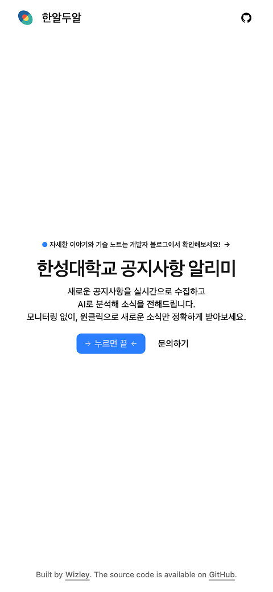

# 한알두알


## Overview

한성대학교의 새로운 공지사항을 수집하고 AI가 분석해, 중요한 소식을 바로 알려주는 서비스입니다.

만든 이유:

- 중요한 공지를 매번 직접 확인해야 하는 불편함
- 불필요한 홍보, 프로모션 글을 걸러내고 핵심 정보만 필터링
- 공지 알림 시스템이 별도로 없음

> 한성대 노티노티 follow-up project

- 모바일 앱 유지보수 힘듬; 핵심 가치를 지닌 기능만 추출

개선점:

- 단순 키워드 포함 비교가 아닌 게시글 맥락 분석; 텍스트 없이 이미지만 올라오는 게시글 다수
- 중복 알림 이슈 해결 (키워드가 여러개 포함될 경우)

## Key Features

- 실시간 공지사항 수집
- AI로 게시글 분석
- 사용자 맞춤 알림
- 게시글 요약 제공


## Tech Stack

`Firebase`

- Cloud Functions
- Authentication
- Firestore
- Hosting
- Cloud Messaging

`React`

- React Router
- shadcn/ui
- Tailwindcss
- PWA

## Architecture



## Contact

`mailto:wizley9999@gmail.com`

## Open Source

`한알두알` 프로젝트는 오픈소스로 운영됩니다.

### How to Use

### 0. Set up Firebase project & Firebase CLI

[여기](https://firebase.google.com/docs/cli)를 참고하세요.

### 1. Install Dependencies

```bash
# From your project root folder
cd frontend
npm install
npm run build
```

```bash
# From your project root folder
cd functions
npm install
```

### 2. Prepare Your `.env` File

```
# frontend/.env
VITE_FIREBASE_API_KEY=
VITE_FIREBASE_AUTH_DOMAIN=
VITE_FIREBASE_PROJECT_ID=
VITE_FIREBASE_STORAGE_BUCKET=
VITE_FIREBASE_MESSAGING_SENDER_ID=
VITE_FIREBASE_APP_ID=
VITE_FIREBASE_MEASUREMENT_ID=
VITE_FIREBASE_VAPID_KEY=
```

```
# functions/.env
OPENAI_API_KEY=
REGION=
AXIOS_TIMEOUT=
HTTP_PASS=
```

### 3. Deploy To Firebase

```bash
firebase deploy
```

### 4. Others

로컬에서 개발 환경을 구동할 수 있습니다.

```bash
# ./frontend
npm run dev
```

```bash
# ./functions
npm run serve
```

## License

AGPLv3 라이선스를 따르고 있습니다. 자세한 내용은 [LICENSE](https://github.com/wizley9999/hanaldual/blob/main/LICENSE)를 확인하세요.
